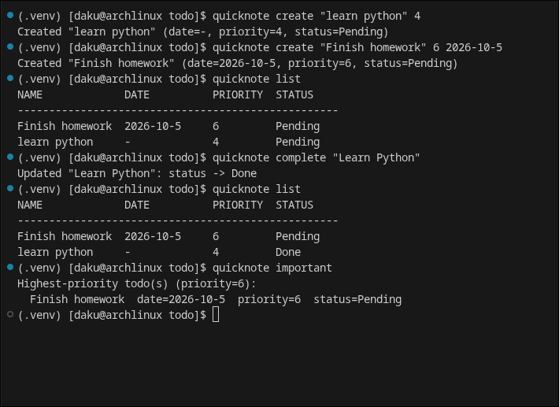

# QuickNote

QuickNote is a lightweight command-line todo manager written in Python.

It stores todos locally in a JSON file and provides simple commands for creating, viewing, editing, deleting, prioritizing, and completing todos.

## ScreenShot 


## Features

- Create todos
- List todos
- Delete todos
- Edit todo names, dates, and priorities
- Increase or decrease priority
- Find the highest-priority todos
- Find todos with dates closest to today
- Mark todos as completed or pending
- Persistent local JSON storage
- Cross-platform data storage
- Date validation
- Helpful CLI error messages
- Automated tests with pytest
- Backwards compatibility with older todo files

## Installation

Clone the repository and enter the project directory:

```bash
git clone https://github.com/dakugaming7487/quicknote.git
cd quicknote
```

Create a virtual environment:

### Linux / macOS

```bash
python3 -m venv .venv
source .venv/bin/activate
```

### Windows

```powershell
python -m venv .venv
.venv\Scripts\activate
```

Install QuickNote in editable mode:

```bash
python -m pip install -e .
```

## Usage

QuickNote uses the `quicknote` command.

### Create a todo

```bash
quicknote create "Finish homework"
```

A date and priority can also be provided:

```bash
quicknote create "Finish homework" 2026-10-05 3
```

Supported date formats are:

```text
YYYY-MM-DD
YYYY/MM/DD
MM/DD/YYYY
DD-MM-YYYY
```

### List todos

```bash
quicknote list
```

Todos are displayed with:

- Name
- Date
- Priority
- Status

Todos are sorted by priority.

### Delete a todo

```bash
quicknote delete "Finish homework"
```

### Edit a todo

Edit the name:

```bash
quicknote edit "Finish homework" name "Finish math homework"
```

Edit the date:

```bash
quicknote edit "Finish homework" date 2026-10-06
```

Edit the priority:

```bash
quicknote edit "Finish homework" priority 5
```

### Change priority

Increase priority:

```bash
quicknote priority "Finish homework" increase 2
```

Decrease priority:

```bash
quicknote priority "Finish homework" decrease 1
```

### Complete a todo

```bash
quicknote complete "Finish homework"
```

This marks the todo as completed.

To mark it as pending again:

```bash
quicknote complete "Finish homework" --pending
```

### Find important todos

Show the highest-priority todo or todos:

```bash
quicknote important
```

Show the todo or todos whose dates are closest to today:

```bash
quicknote important --date
```

### Get help

Show the main help page:

```bash
quicknote --help
```

Show help for a specific command:

```bash
quicknote create --help
```

## Data Storage

QuickNote stores your todo data locally on your computer.

### Windows

```text
%LOCALAPPDATA%\QuickNote\todos.json
```

For example:

```text
C:\Users\YourName\AppData\Local\QuickNote\todos.json
```

### macOS

```text
~/Library/Application Support/QuickNote/todos.json
```

### Linux

If `XDG_DATA_HOME` is set:

```text
$XDG_DATA_HOME/quicknote/todos.json
```

Otherwise:

```text
~/.local/share/quicknote/todos.json
```

QuickNote does not require a database or cloud service.

## Privacy

Your todos are stored locally on your own computer.

The `todos.json` file is intentionally excluded from Git because it may contain private or personal information.

Do not commit your personal `todos.json` file to the repository.

A new installation automatically creates the required data directory when QuickNote saves its first todo.

## Existing Todo Data

QuickNote is designed to remain compatible with older todo files.

Older todos may not contain a `completed` field. When they are loaded, QuickNote treats them as pending automatically.

You do not need to recreate your existing todos after updating QuickNote.

## Testing

QuickNote uses `pytest` for automated tests.

Install the development test dependency if necessary:

```bash
python -m pip install pytest
```

Run the complete test suite:

```bash
pytest
```

The tests cover functionality including:

- Creating todos
- Listing todos
- Deleting todos
- Editing todos
- Priority changes
- Invalid priority values
- Date parsing
- Invalid dates
- Empty todo lists
- Priority sorting
- Date-based selection
- Completion status
- Local data storage
- Backwards compatibility

## Project Structure

```text
quicknote/
├── src/
│   └── quicknote_cli/
│       ├── __init__.py
│       └── quicknote.py
├── tests/
│   └── test_quicknote.py
├── .gitignore
├── LICENSE
├── pyproject.toml
└── README.md
```

## Development

Install the project in editable mode:

```bash
python -m pip install -e .
```

Run the tests:

```bash
pytest
```

Run QuickNote directly:

```bash
quicknote --help
```

Before committing changes, it is recommended to run:

```bash
pytest
git status
```

Make sure personal todo data is not staged or committed.

## License

QuickNote is released under the MIT License.

See [LICENSE](LICENSE) for the full license text.